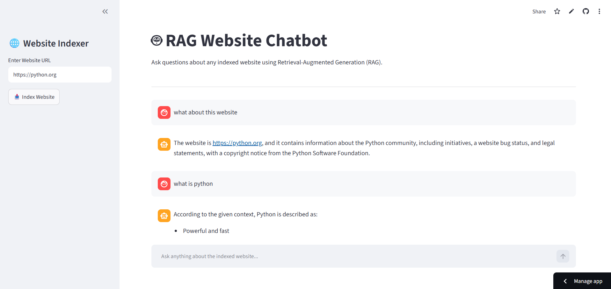

# 🤖 RAG Website Chatbot

A Retrieval-Augmented Generation (RAG) based chatbot that allows users to interact with any website by asking natural language questions. The application scrapes website content, converts it into vector embeddings, stores them in ChromaDB, retrieves the most relevant information, and generates accurate responses using the Groq LLM.

---

## 📌 Project Overview

The RAG Website Chatbot enables users to:

* Index any public website.
* Extract and process website content.
* Store semantic embeddings in a vector database.
* Retrieve the most relevant information based on user queries.
* Generate context-aware answers using a Large Language Model (LLM).

Unlike traditional chatbots, this application answers questions using information retrieved directly from the indexed website, improving accuracy and reducing hallucinations.

---

## ✨ Features

* 🌐 Index any public website
* 📄 Automatic website scraping
* ✂️ Intelligent text chunking
* 🧠 Sentence Transformer embeddings
* 📚 ChromaDB vector database
* 🔍 Semantic similarity search
* 🤖 Context-aware answer generation using Groq LLM
* 💬 Interactive chat interface with Streamlit
* ☁️ Deployed backend and frontend

---

## 🏗️ System Architecture

```text
                User
                  │
                  ▼
        Streamlit Frontend
                  │
            HTTP Request
                  │
                  ▼
        FastAPI Backend
                  │
        ┌─────────┼─────────┐
        │         │         │
        ▼         ▼         ▼
   Website     Chunking   Embeddings
   Scraper
                  │
                  ▼
             ChromaDB
                  │
                  ▼
         Relevant Chunks
                  │
                  ▼
              Groq LLM
                  │
                  ▼
             Final Answer
                  │
                  ▼
                User
```

---

## ⚙️ Tech Stack

### Frontend

* Streamlit

### Backend

* FastAPI
* Uvicorn

### AI & Machine Learning

* Sentence Transformers
* all-MiniLM-L6-v2
* Groq LLM

### Vector Database

* ChromaDB

### Web Scraping

* BeautifulSoup
* Requests

### Deployment

* Railway (Backend)
* Streamlit Community Cloud (Frontend)

---

## 🚀 Workflow

1. User enters a website URL.
2. The backend scrapes the website content.
3. Content is divided into smaller chunks.
4. Sentence Transformer generates vector embeddings.
5. Embeddings are stored in ChromaDB.
6. User asks a question.
7. The question is converted into an embedding.
8. ChromaDB retrieves the most relevant chunks.
9. Retrieved context is sent to the Groq LLM.
10. The generated answer is displayed in the Streamlit interface.

---

## 📂 Project Structure

```
rag_chatbot/
│
├── backend/
│   ├── main.py
│   ├── scraper.py
│   ├── chunker.py
│   ├── embeddings.py
│   ├── vector_store.py
│   ├── retriever.py
│   ├── indexer.py
│   ├── rag.py
│   ├── llm.py
│   ├── requirements.txt
│
├── frontend/
│   ├── app.py
│   ├── requirements.txt
│
└── README.md
```

---

## 🛠️ Installation

### Clone the repository

```bash
git clone https://github.com/your-username/your-repository.git
cd your-repository
```

### Backend

```bash
cd backend
pip install -r requirements.txt
uvicorn main:app --reload
```

### Frontend

```bash
cd frontend
pip install -r requirements.txt
streamlit run app.py
```

---

## 🌍 Deployment

### Backend

Hosted on **Railway**

### Frontend

Hosted on **Streamlit Community Cloud**

---

## 📸 Screenshots

Add screenshots of:

* Home Page


---

## 🔮 Future Enhancements

* Support multiple websites simultaneously
* PDF and document indexing
* JavaScript-rendered website support
* User authentication
* Conversation history
* Source citations in responses
* Multi-language support

---

## 👩‍💻 Author

**Abinaya S**

Artificial Intelligence and Data Science Student

---

## 📄 License

This project is developed for educational and learning purposes.
